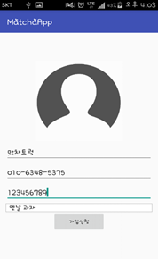
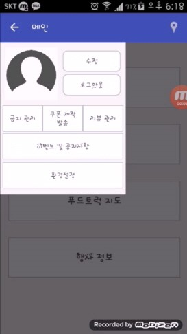

# 맛차 [푸드트럭 위치정보 안드로이드 애플리케이션]

> 푸드트럭 정보 공유 App ‘맛차’는 위치기반 서비스를 중심으로 사업자와 고객을 연결하는 O2O서비스 어플리케이션입니다.
> ‘맛차’ 어플리케이션은 크게 사업자용 기능과 일반 사용자용 기능으로 나뉘며 주요 기능은 다음과 같습니다.  

### 사업자)
   1.	스케쥴 관리 기능을 이용하여 정기적인 영업 지역에 대한 위치정보와 시간표를 DB에 등록할 수 있습니다.  
   2.	실시간 위치정보 수집 및 DB 전송 기능을 이용하여 실시간 영업 현황을 고객들에게 알릴 수 있습니다. 
   3.	Geo-fencing 기능을 이용하여 인접한 고객들에게 도착 알림 및 쿠폰 전송을 할 수 있습니다.

### 일반 사용자)
   1.	내 주변 푸트트럭 조회 기능을 이용하여 주변의 영업중인 푸드트럭에 대한 정보를 알 수 있습니다. 
   2.	푸드트럭 스케쥴 조회 기능을 통해 언제 어느 장소에 어떤 푸드트럭이 오는지를 미리 알 수 있습니다. 
   3.	인기 푸드트럭 조회 기능을 이용하여 평점이 높은 순으로 푸드트럭을 조회할 수 있습니다.
   4.	리뷰, 평점 남기기 기능을 통해 사업자에게 피드백을 주고, 이용자간 맛, 서비스에 대한 정보를 공유할 수 있습니다.

### 앱 작동 화면

<table>
    <tr>
        <td align="middle">
            <figure>
                
                <figcaption>초기화면</figcaption>
            </figure>
        </td>
        <td align="middle">
            <figure>
                
                <figcaption>회원가입</figcaption>
            </figure>
        </td>
        <td align="middle">
            <figure>
                
                <figcaption>사업자 등록</figcaption>
            </figure>
        </td>
        <td align="middle">
            <figure>
                
                <figcaption>사업자 메인</figcaption>
            </figure>
        </td>
    </tr>
    <tr>
        <td align="middle">
            <figure style="display:inline-block;">
                
                <figcaption>일정 등록</figcaption>
            </figure>
        </td>
        <td align="middle">
            <figure style="display:inline-block;">
                
                <figcaption>Navigation Drawer</figcaption>
            </figure>
        </td>
        <td align="middle">
            <figure style="display:inline-block;">
                
                <figcaption>쿠폰 등록 및 발송</figcaption>
            </figure>
        </td>
        <td align="middle">
            <figure style="display:inline-block;">
                
                <figcaption>사용자 메인</figcaption>
            </figure>
        </td>
    </tr>
    <tr>
        <td align="middle">
            <figure style="display:inline-block;">
                
                <figcaption>푸드트럭 지도</figcaption>
            </figure>
        </td>
        <td align="middle">
            <figure style="display:inline-block;">
                
                <figcaption>내 주변 푸드트럭</figcaption>
            </figure>
        </td>
        <td align="middle">
            <figure style="display:inline-block;">
                
                <figcaption>인기 푸드트럭</figcaption>
            </figure>
        </td>
        <td align="middle">
            <figure style="display:inline-block;">
                
                <figcaption>푸드트럭 정보</figcaption>
            </figure>
        </td>
    </tr>
</table>
